# StableDiffusion之秋叶整合包的探索之旅


## StableDiffusion之秋叶整合包的探索之旅

### 1. 前言

为了确保AI绘画的流畅体验，推荐设备上安装有 Nvidia 独立显卡。显存至少需达到6GB，以满足基本的出图需求；若要进行 AI 训练，则建议显存在12GB以上。显卡型号方面，RTX40 系列是首选，至少也要达到 RTX30 系列的标准。

若您手头没有N卡，虽然可以利用CPU进行图形处理，但效率相对较低，出图速度也会受到影响。此外，为了支持高效的AI绘画工作，CPU性能也需强劲，并且至少配备16GB内存。

简而言之，对于简单的图形处理或初步体验，CPU或许足够。然而，若您追求专业的AI绘画效果，N卡搭配高性能CPU和充足内存才是理想的选择。

### 2. 安装与配置

**1. 查看显卡型号**

打开`设备管理器`，找到`显示适配器`，可以看到设备具体的显卡型号

><center>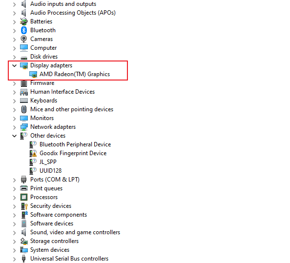</center>

<center><font color=silver>img-2.1</font></center>

**2. 依赖&安装包下载**

如果设备是首次安装，需要下载启动依赖 `windowsdesktop-run-time-6.0.25-win-x64.exe`，安装依赖后，再解压 `sd-webui-aki-v4.8.7z` 压缩包。

> <center>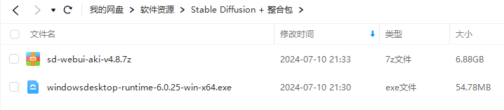</center>

<center><font color=silver>img-2.2</font></center>

**3. 启动器配置**

**1）打开启动器**

解压得到 `sd-webui-aki-v4.8` 后，打开 `A绘世启动器.exe`

> <center>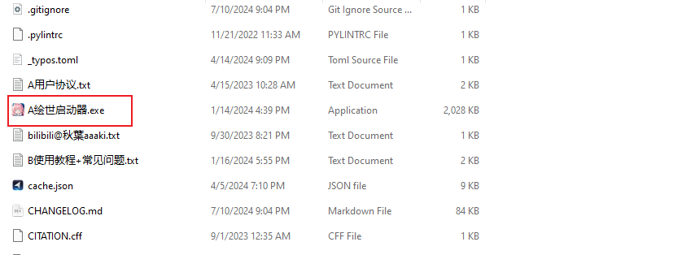</center>

<center><font color=silver>img-2.3</font></center>

**2）更改配置模式**

打开启动器后，进入 `设置` 界面，将配置模式设置为专家（可以根据个人习惯修改语言设置）。

><center>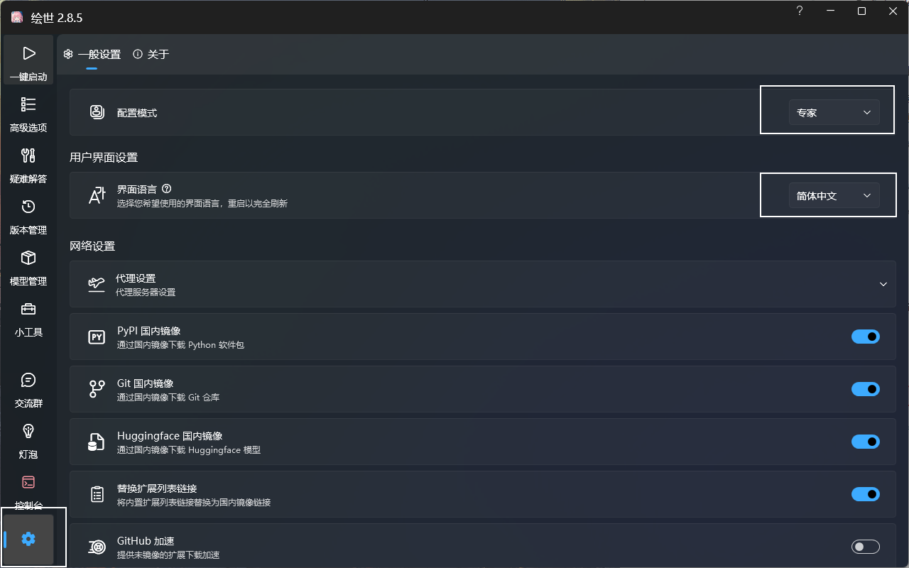</center>

<center><font color=silver>img-2.4</font></center>

**3）切换分支**

进入`版本管理`，可以根据自己的生成引擎（显卡或CPU）来选择不同分支，由于博主设备使用 CPU 参与计算，分支选择 `lshqqytiger/stable-diffusion-webui-directml-主线`。

> <center>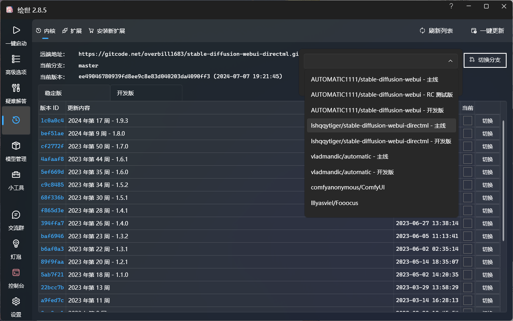</center>

<center><font color=silver>img-2.5</font></center>

**4）更新分支**

切换分支后，启动器提示分支切换成功，请刷新列表，一键更新后重启启动器，点击确定。然后点击启动器的`刷新列表`和`一键更新`按钮。接着重新打开启动器可以发现已经切换到了最新版本 `ee49046`。

> <center>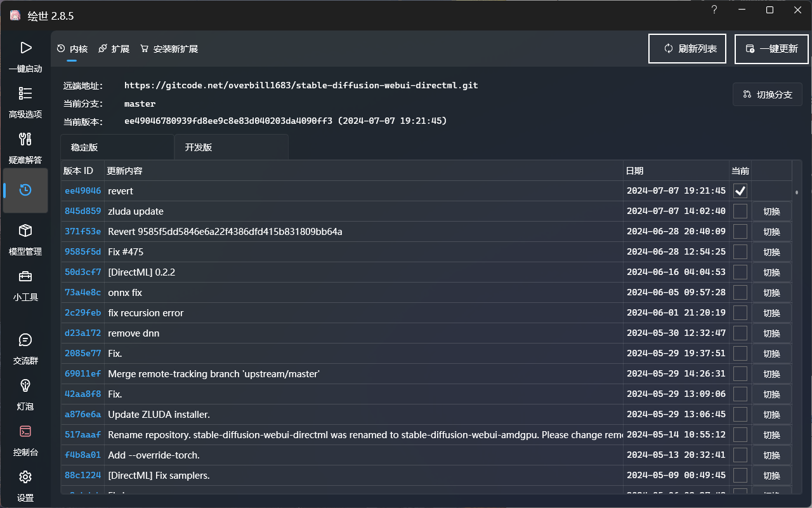</center>

<center><font color=silver>img-2.6</font></center>

**5）高级选项**

进入高级选项界面，根据自身设备选择`生成引擎`。如果是显卡参与计算的话，建议根据显卡规格设置`显存优化`。

> <center>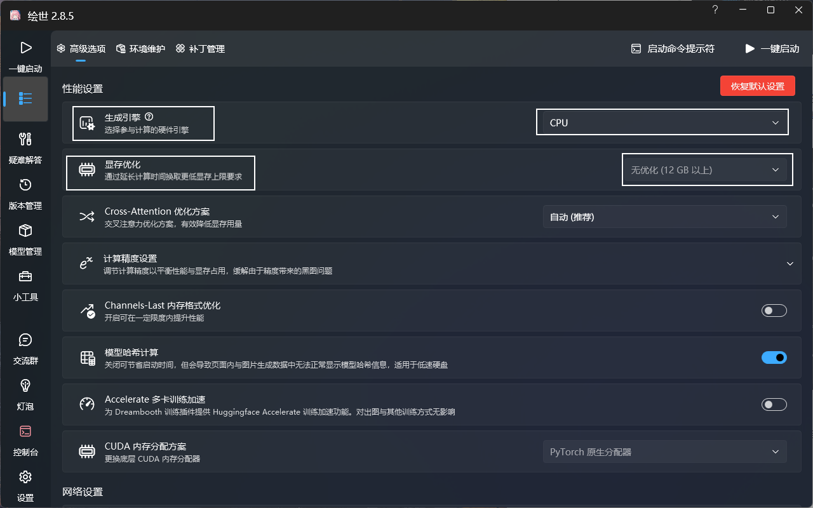</center>

<center><font color=silver>img-2.7</font></center>

**6）环境维护**

根据生成引擎，安装特定版本的 `PyTorch` 和 `xFormers`

> <center>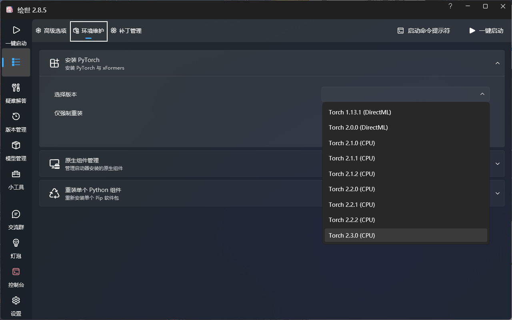</center>

<center><font color=silver>img-2.8</font></center>

### 3. 一键启动

**1. 准备启动**

进入启动界面，点击`一键启动`按钮

> <center>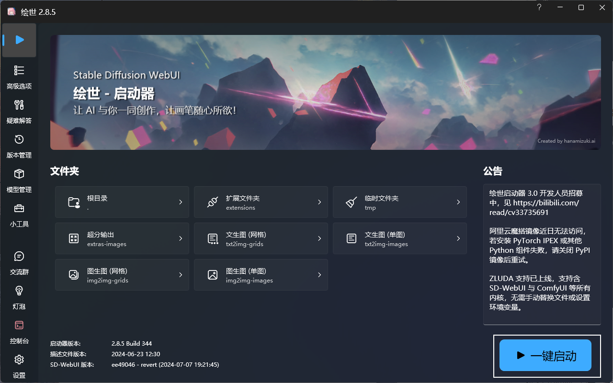</center>

<center><font color=silver>img-3.1</font></center>

**2. 安装组件**

启动过程中可能遇到缺少 `module` 的情况，如

```bash
ModuleNotFoundError: No module named 'optimum'
```

此时复制 `optimum`，进入环境维护界面，点击`重装单个 Python 组件`，将 `optimum` 粘贴到 `Pip 软件包名称` 对应的文本框，点击 `重新安装`。

> <center>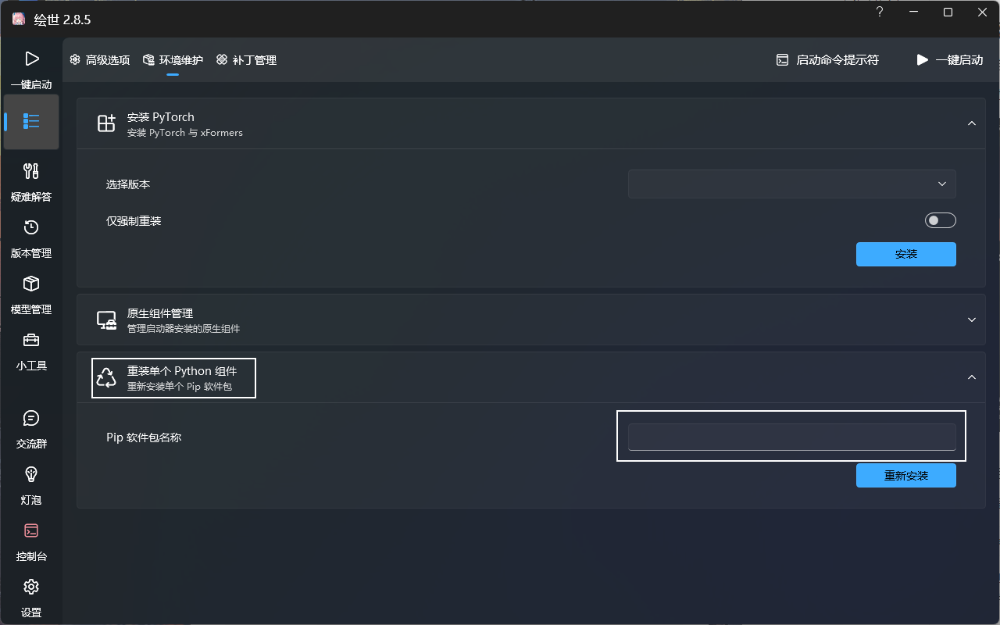</center>

<center><font color=silver>img-3.2</font></center>

**3. 启动成功**

上述初步配置的步骤全部完成后，会在网页启动程序，其默认端口为 `7860`

> <center>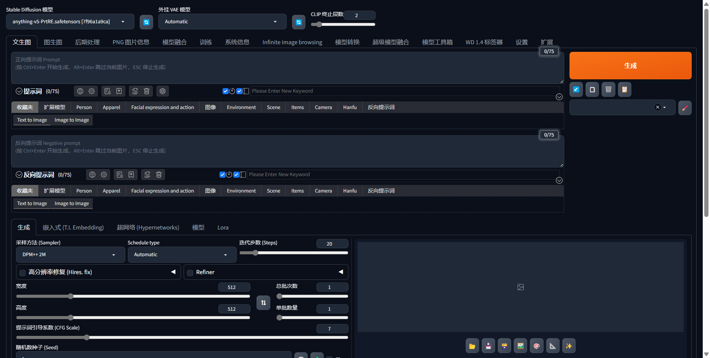</center>

<center><font color=silver>img-3.3</font></center>

### 4. 插件

