# 搭建博客 Github+Hugo+LoveIt


# 如何用 GitHub Pages + Hugo + LoveIt 搭建个人博客

## 1. 概念，搭建思路和运行环境

### 1.1 什么是 GitHub Pages？

GitHub Pages 是 GitHub 提供的免费托管服务，用于托管静态网站。无论是个人、项目还是组织，都可以利用 GitHub Pages 创建和托管网站。

### 1.2 什么是 Hugo?

Hugo 是一个快速、现代的静态网站生成器，广泛用于创建博客、公司网站、文档网站等。它以速度和灵活性著称，允许用户使用模板和内容文件生成静态 HTML 文件。

### 1.3 什么是 LoveIt?

Hugo 主题 LoveIt 是一个简洁而优雅的主题，专为博客和个人网站设计。它提供了一些关键功能，使用户可以轻松地创建和定制自己的网站。

### 1.4 网站搭建思路

1. 创建 2 个GitHub仓库：
   - 博客源仓库：储存所有 Markdown 源文件（博客内容），和博客中用到的图片等。
   - GitHub Pages 储存由 Hugo 从 Markdown 文件生成的 HTML 文件。
2. 将**博客源仓库**中, 由 Hugo 生成的静态 HTML 文件部署到远端 **GitHub Pages 仓库**中。

> 目的：将博客源文件单独存放到私有仓库里面，避免访客直接从公共的 GitHub Pages 仓库中获取文章源文件。

<br>

## 2. 创建 GitHub 仓库以及本地仓库

### 2.1 创建博客源仓库

1. 进入 GitHub 个人主页，新建博客源仓库。

> <center>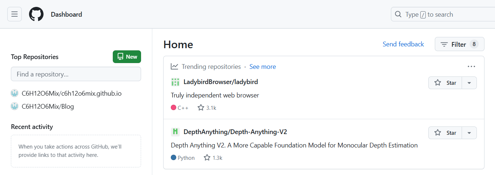</center>

<center><font color=silver>img-2.1</font></center>

2. &#x2714;勾选 **Private**，设置为私有仓库。
3. &#x2714;勾选添加 **README** 文件。

> <center>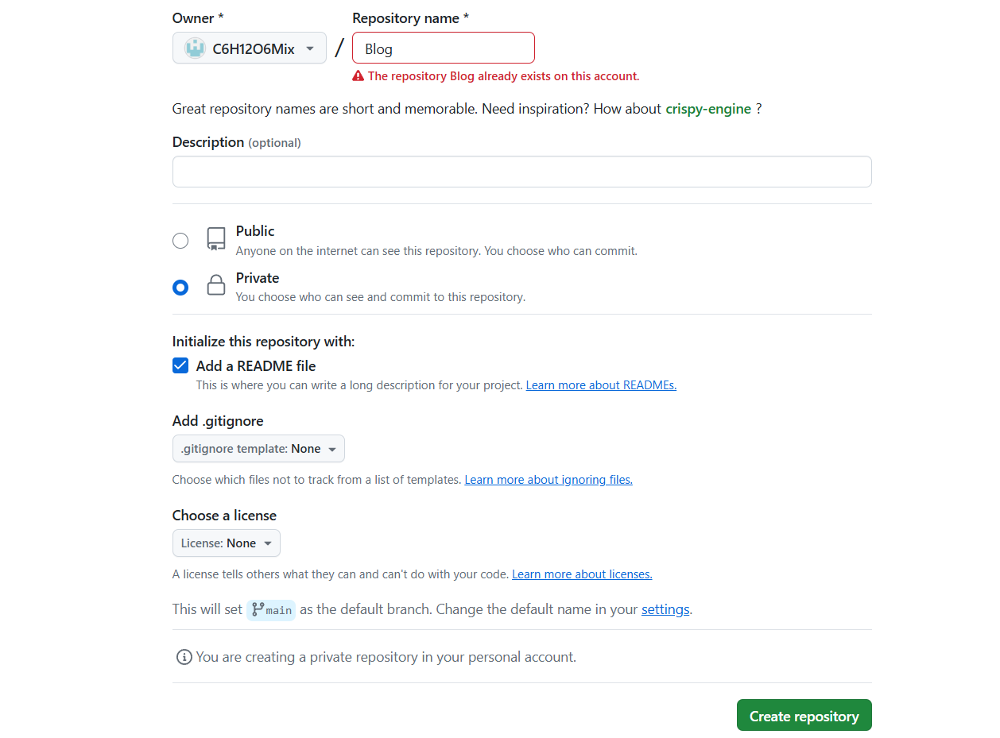</center>

<center><font color=silver>img-2.2</font></center>

### 2.2 创建GitHub Page 仓库

1. 命名 **GitHub Pages** 仓库，这个仓库必须使用特殊的命名格式 `<username.github.io>`， `<username>` 是自己的 GitHub 的用户名。
2. 勾选 **Public**，设置为公开仓库。
3. 勾选添加 **README** 文件，这会设置 `main` 分支为仓库的默认主分支，这在后面提交推送博客内容时很重要。

> <center>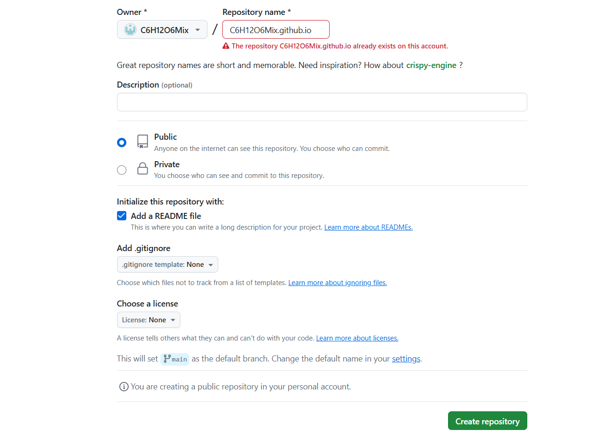</center>

<center><font color=silver>img-2.3</font></center>

### 2.3 克隆博客源仓库到本地

1. 打开 `git` 进入，想要在本地储存项目的文件夹，即源仓库的**上级目录**（博主这里的路径为 `D:\File\BlogSorce`）。

> <center>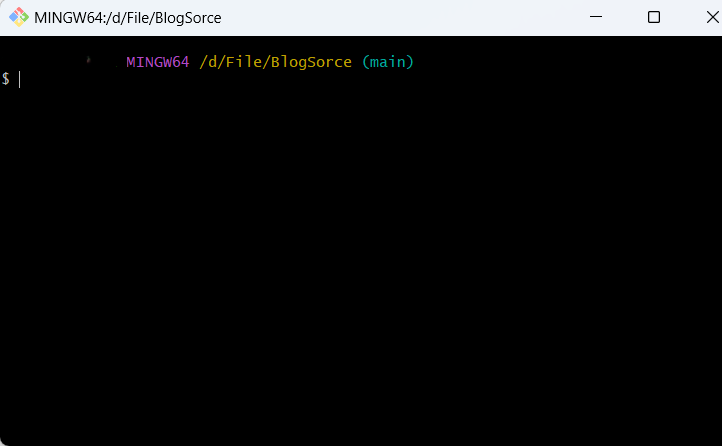</center>

<center><font color=silver>img-2.4</font></center>

2. 克隆**博客源仓库**到项目文件夹，`git` 输入的指令如下：

```bash
git clone git@github.com:C6H12O6Mix/Blog.git
```

3. 最终的克隆结果：

> <center>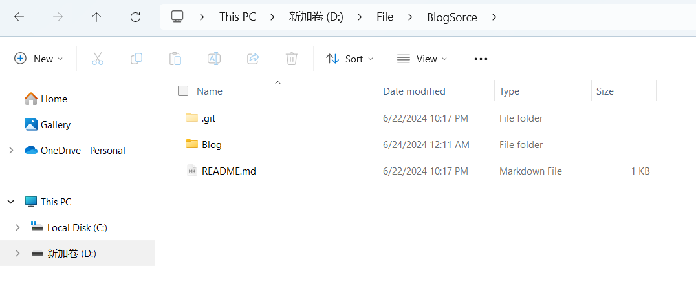</center>

<center><font color=silver>img-2.5</font></center>

<br>

## 3. Hugo 的安装和配置

### 3.1 下载安装 Hugo

> Hugo 官网：https://gohugo.io/
>
> Hugo GitHub 仓库：https://github.com/gohugoio/hugo/releases
>
> Hugo 提供了两种版本：标准版本 (standard) 提供了构建网站的基础功能；拓展版本 (extended) 额外还支持 WebP 编码、SASS 等功能（官方建议使用**拓展版本**）。

1. 点击 Hugo GitHub 仓库：https://github.com/gohugoio/hugo/releases。
2. 根据自己的环境下载发行版 hugo，博主这里下载最新版本的 `hugo_extended_0.127.0_windows-amd64.zip`。

> <center>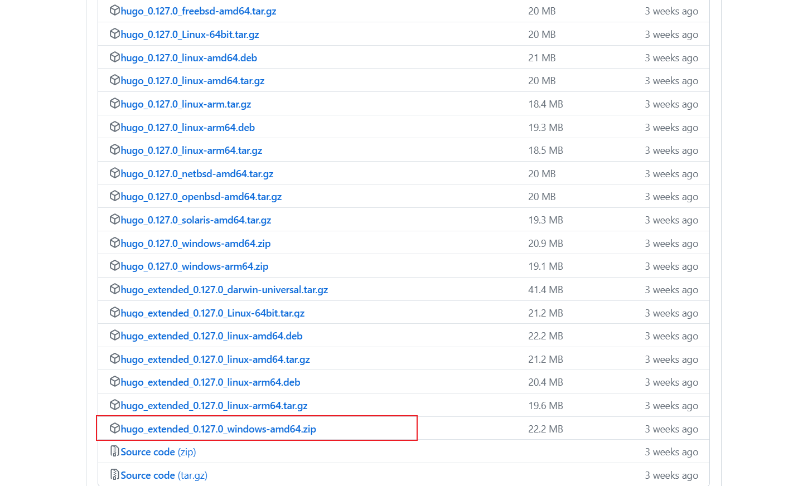</center>

<center><font color=silver>img-3.1</font></center>

### 3.2 配置 Hugo 环境

1. 。解压 `hugo_extended_0.127.0_windows-amd64.zip`。
2. 将其中的 `hugo.exe` 文件复制到指定文件夹下（可以自定义），如：`D:\System\Hugo\bin`。

> <center>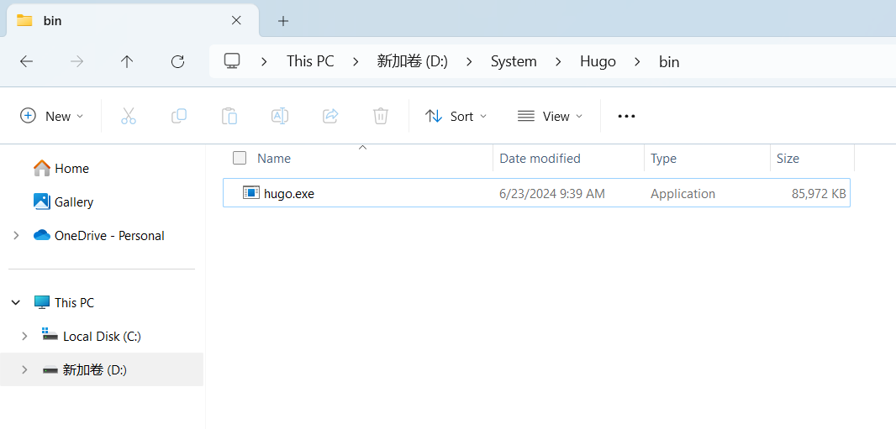</center>

<center><font color=silver>img-3.2</font></center>

3. 在系统环境变量中，添加上述 `hugo.exe` 的存放位置，即 `D:\System\Hugo\bin`。

> <center>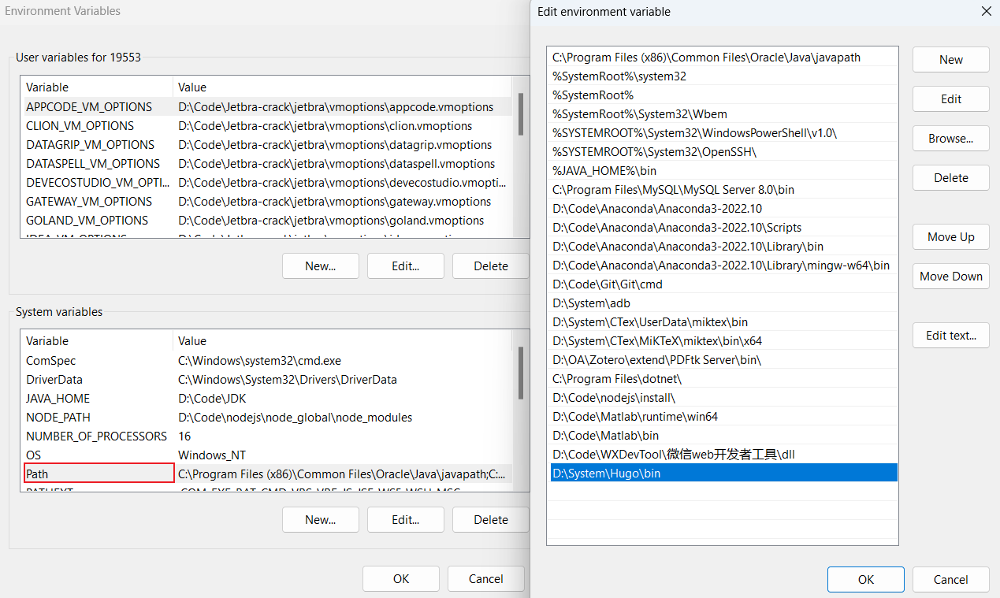</center>

<center><font color=silver>img-3.2</font></center>

4. 以管理员身份运行 cmd，输入指令 `hugo -help`，出现以下结果，则配置成功。

> <center>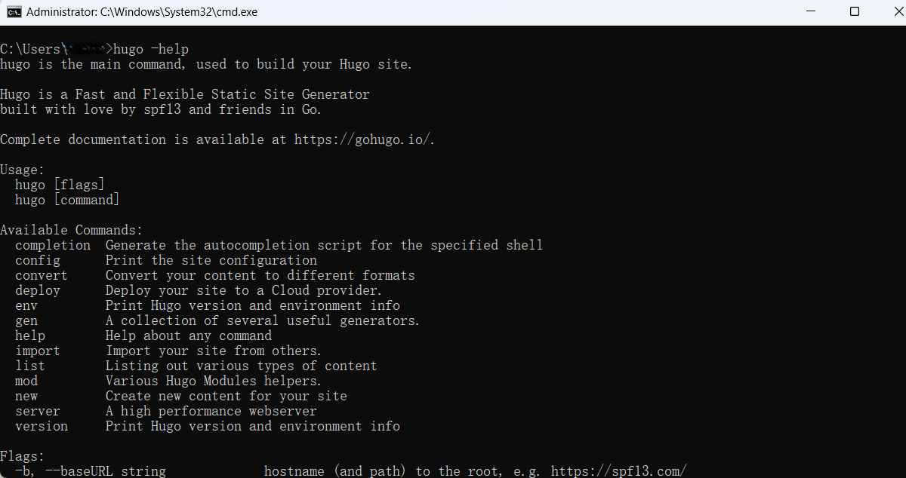</center>

<center><font color=silver>img-3.3</font></center>

<br>

## 4. 使用 Hugo 创建网站

1. 进入刚刚克隆下来的博客源仓库文件夹（比如：我的博客源仓库文件夹名是 `Blog`，则在 `D:\File\BlogSorce` ），在这个文件夹里用 Hugo 创建一个网站文件夹。
2. 用 Hugo 创建网站文件夹的命令是 `hugo new site 网站名字`。
3. 用 Hugo 创建的网站共有 8 个文件夹和 2 个文件，这些文件分别表示：

```
my-website/
├── archetypes/
│   └── default.md
├── assets/
├── content/
├── data/
├── i18n/
├── layouts/
├── static/
├── themes/
├── hugo.toml
```

- **archetypes/**：内容架构目录，作为新内容文件的模板。
  - `default.md`：当使用 `hugo new /posts/xxx.md` 时，Hugo 会基于此生成新文件。
- **assets/**：资源目录，用于存放 SCSS、JavaScript 文件以及其他需要 Hugo Pipes 处理的资源。
- **content/**： 内容目录，存放网站的所有内容文件，包括文章、页面等。可以创建子文件夹来组织内容。
- **data/**： 数据目录，用于存放 YAML、JSON 或 TOML 格式的数据文件。
- **i18n/**： 国际化目录，用于存放 TOML 格式的语言文件，支持多语言。
- **layouts/**： 布局模板目录，包含所有的 HTML 模板文件，定义了网站的结构和布局。
- **static/**： 静态文件目录，存放静态资源文件（如图像、CSS、JavaScript），这些文件在生成网站时将直接复制到公共目录，保持原样提供给浏览器。
- **themes/**： 主题目录，可以将外部主题克隆到这个目录中，或者创建和存放自定义主题。
- **hugo.toml**： 配置文件，包含网站的基本配置选项，例如网站标题、语言、主题等。通常用于设置全局配置，如站点信息、菜单、参数等。

<br>

## 5. 安装配置 Hugo 主题 LoveIt

### 5.1 安装 LoveIt

1. 位于博客项目**根目录**（D:\File\BlogSorce），输入以下指令：

```bash
git clone https://github.com/dillonzq/LoveIt.git themes/LoveIt
```

2. 克隆成功后在 `./themes` 文件夹下会出现 `LoveIt` 文件夹。

### 5.2 LoveIt 关于 hugo.toml 文件的外观参数 

1. 配置 `./hugo.toml` 文件，可以从 LoveIt 主题的样例文件 `./themes/LoveIt/exampleSite` 进行复制和修改，或者进入到 [LoveIt 的官方文档](https://hugoloveit.com/theme-documentation-basics/) 进行查看。
2. 其中部分需要自定义的内容为：

```toml
# 网站显示的标题，可自定义修改
title = "xxx" 

# 作者信息，可自定义修改
[author]
	name = "xxx"
	email = "xxxxxx@xx.com"

# 网站标题栏，可以自定义修改
[params.header]
	...
    [params.header.title]
    # URL of the LOGO 可以使用 URL 的方式在标题栏添加 logo
    logo = ""
    # 网站标题栏显示的标题，可以自定义修改
    name = "xxx"
    # 打字机特效
    typeit = false
    
# 主页个人信息
[params.home]
	...
	[params.home.profile]
		...
		# 将头像图片放置于项目根目录下的 ./assets/images, 并命名为 avatar.png
		avatarURL = "/images/avatar.png"
		# 主标题-个人名称
		title = "xxx"
		# 副标题-简述
		subtitle = "xxxxxx"

# 显示在主页的个人社交链接，按需填写
[params.social]
	GitHub = ""
	Twitter = ""
	...
```

<br>

## 6. 用 Hugo 创建文章

推荐写法：在博客项目根目录，输入以下命令（注意文件名不要输入空格或者其他特殊字符）：

```bash
hugo new ./posts/新建文件夹(最好命名为文章主题)/index.md
```

1. 使用这个命令后会在 `./content/posts/新建文件夹` 下创建 `idex.md` 文件，并且会套用套用 `archetypes` 文件夹中的 `default.md` 模版。

2. 之所以用 `hugo new ./posts/新建文件夹/index.md`，而不直接使用 `hugo new 文章主题.md` 是方便后续在博客中插入图片使用相对路径。

3. 例如：想要在博客文章中插入一张图片 `img-01.png`，又不想使用图床，可以利用上述创建的`新建文件夹`，通过相对路径来插入图片。
4. 在文件夹下 创建 `img`（名称自拟）文件夹，然后文章中想要插入的位置输入。

```html

```

<br>

## 7. 本地调试和预览

1. 在发布到网站前可以在本地预览网站或内容的效果，运行命令：

```bash
hugo server
```

2. 也可以在本地编辑 Markdown 文件时，通过 `hugo server` 来实时预览显示效果。
3. `hugo server` 运行成功后，可以在 `http://localhost:1313/` 中预览

<br>

## 8. 发布内容

### 8.1 GitHub Actions 原理

GitHub Actions 是一种  CI/CD 工具（`Continuous Integration`-持续集成，`Continuous Deployment`-持续部署或`Continuous Delivery`-持续交付），能够在特定事件发生时自动执行预定义的任务。

> 工作原理

1. **触发事件（Triggers）**：特定事件（如代码提交、pull request）触发 GitHub Actions。
2. **工作流（Workflows）**：事件触发后，Actions 按 `.github/workflows` 目录下定义的工作流执行任务。
3. **任务（Jobs）**：任务包含多个步骤（steps），在独立的虚拟环境中运行。
4. **步骤（Steps）**：步骤是具体操作，如运行命令、执行脚本等。

### 8.2 生成 Actions secrets

1. 生成 Personal access tokens 首先点击 GitHub 头像在下拉栏里进入 Setting -> Developer Settings -> Personal access tokens -> Tokens (classic)

> <center>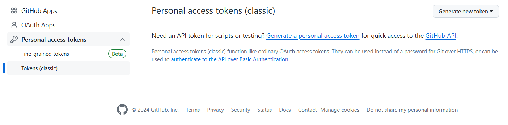</center>

<center><font color=silver>img-8.1</font></center>

2. 点击 `Generate token`，`Note` 的内容可以随心填写；`Expiration` 为 token 过期时间，这里直接拉满，选择永不过期；`Select scope` 为 token 权限，这里选择 `repo`，和 `admin:repo_hook`

> <center>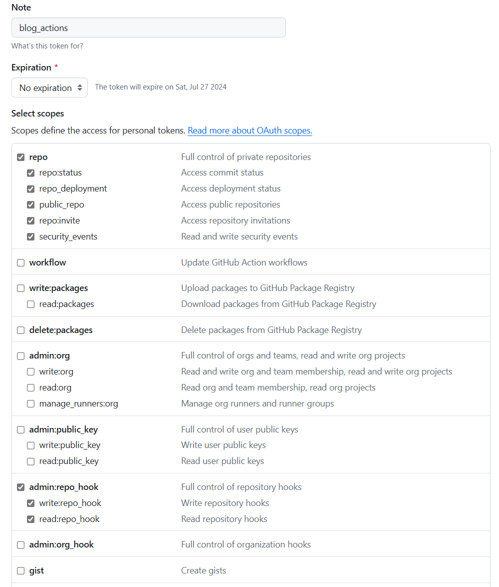</center>

<center><font color=silver>img-8.2</font></center>

3. 点击 `Generate token` 生成 token， **记住一定要复制保存，该 token 只显示一次。**
4. 进入博客源仓库的 Setting -> Secrets and variables ->Actions 一栏，点击 `New respository secret`

> <center>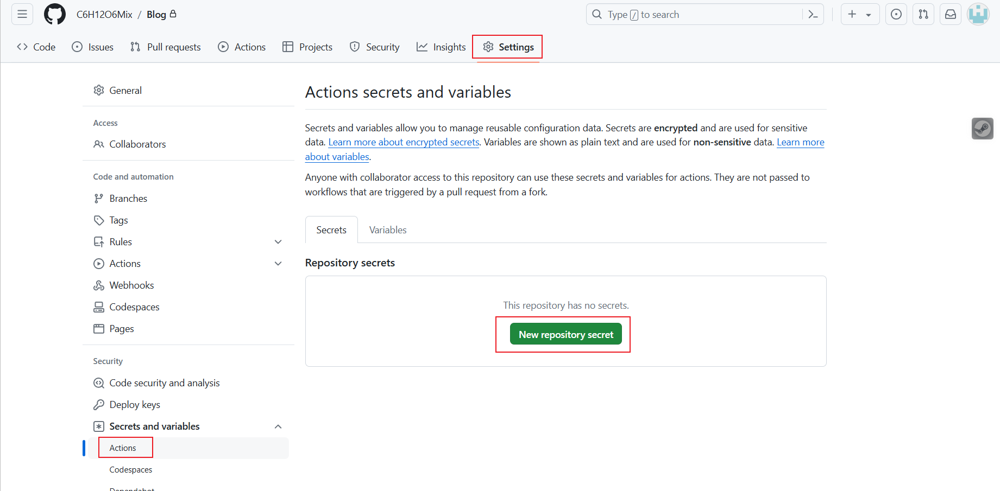</center>

<center><font color=silver>img-8.2</font></center>

### 8.3 配置 acitons 文件

1. 在本地源仓库文件夹的根目录新建两个文件夹 `./.github/workflows`，在 `workflows` 里新建一个后缀为 `xxx.yml` 的配置文件，其中名字自取，这里暂时命名为 `ghpages.yml`。

><center>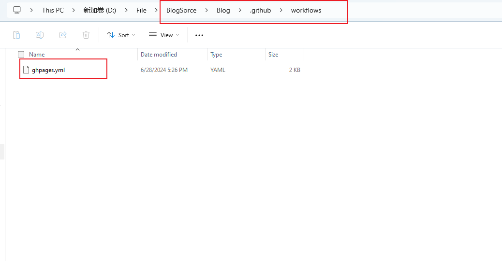</center>

<center><font color=silver>img-8.3</font></center>

2. 修改 `ghpages.yml` 的配置，其中需要修改的部分：
   - `external_repository`： 修改为自己的 GitHub page 仓库
   - `personal_token`：${{ secrets.XXX }} XXX 修改成上面生成 Actions secrets 步骤中取得的名称。

```yaml
name: github pages # 名字自取

on:
  push:
    branches:
      - main  # 这里的意思是当 main分支发生push的时候，运行下面的jobs，这里先改为github-actions

jobs:
  deploy: # 任务名自取
    runs-on: ubuntu-latest	# 在什么环境运行任务
    steps:
      - uses: actions/checkout@v2	# 引用actions/checkout这个action，与所在的github仓库同名
        with:
          submodules: true  # Fetch Hugo themes (true OR recursive) 获取submodule主题
          fetch-depth: 0    # Fetch all history for .GitInfo and .Lastmod

      - name: Setup Hugo	# 步骤名自取
        uses: peaceiris/actions-hugo@v2	# hugo官方提供的action，用于在任务环境中获取hugo
        with:
          hugo-version: 'latest'	# 获取最新版本的hugo
          # extended: true

      - name: Build
        run: hugo --minify	# 使用hugo构建静态网页

      - name: Deploy
        uses: peaceiris/actions-gh-pages@v3	# 一个自动发布github pages的action
        with:
          # github_token: ${{ secrets.GITHUB_TOKEN }} 该项适用于发布到源码相同repo的情况，不能用于发布到其他repo
          external_repository: C6H12O6Mix/c6h12o6mix.github.io	# 发布到哪个repo
          personal_token: ${{ secrets.BLOG_ACTION }}	# 发布到其他repo需要提供上面生成的personal access token
          publish_dir: ./public	# 注意这里指的是要发布哪个文件夹的内容，而不是指发布到目的仓库的什么位置，因为hugo默认生成静态网页到public文件夹，所以这里发布public文件夹里的内容
          publish_branch: main	# 发布到哪个branch
```

### 8.4 推送代码到源仓库

> 注意：在推送代码之前，需要将 `./themes/LoveIt` 下的 `.git` 以及 `.github` 文件夹的内容。否则，GitHub 会将 `LoveIt` 文件夹识别为子模块，导致 GitHub Action 在部署时，无法识别 `./themes/LoveIt` 下的文件，从而部署失败。

1. 将 `Blog` 文件夹初始化为 Git 仓库，并设置默认主分支为 main。这么做的原因是：GitHub 创建仓库时生成的默认主分支名是 main 用 `git init` 初始化 Git 仓库时创建的默认主分支名是 `master` 将 git init 创建的 master 修改成 main ，再推送给远端仓库，这样才不会报错。

```bash
git init -b main
```

2. 将 `public` 文件夹关联远程 GitHub Pages 仓库，使用 GitHub Pages 仓库的 SSH 链接。

```bash
git remote add origin git@github.com:C6H12O6Mix/Blog.git
```

3. 推送本地文件到远程仓库

```bash
git pull --rebase origin main
git add .
git commit -m "...(修改的信息)"
git push origin main
```

4. 推送完成之后到 GitHub 仓库中的 Actions 中就可以看到 runs 运行成功，然后可以通过类似以下链接，访问你的博客了。

```http
https://c6h12o6mix.github.io/
```

<br>

## Reference

- [如何用 GitHub Pages + Hugo 搭建个人博客 · KrislinBlog](https://krislinzhao.github.io/docs/create-a-wesite-using-github-pages-and-hugo/#4-使用-hugo-创建网站)

